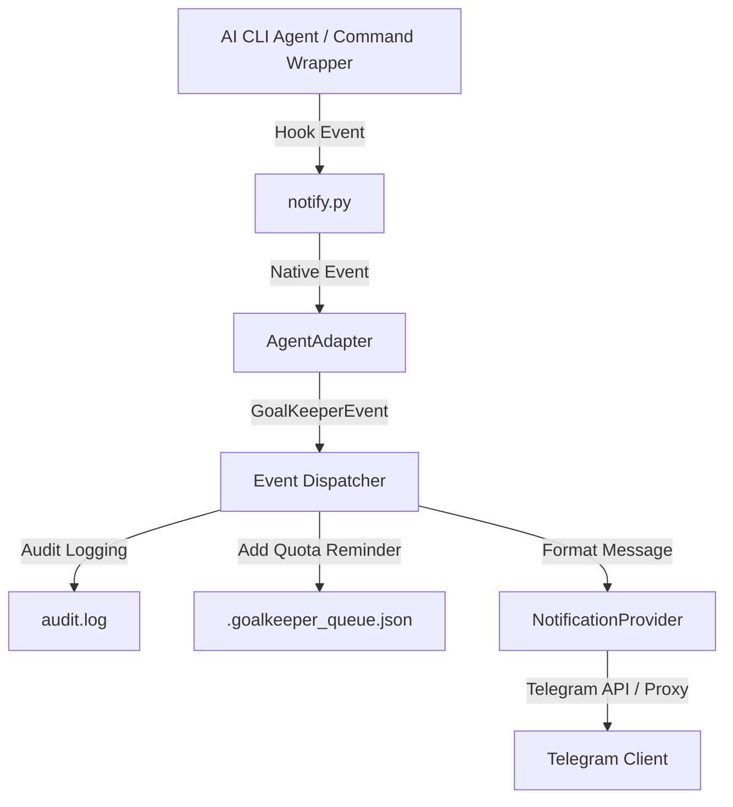

# 🥅 GoalKeeper v1.0.0 Migration & Architecture Guide

GoalKeeper v1.0.0 introduces a modular, extensible, and production-ready architecture designed to support a wide range of current and future AI CLI agents and notification providers.

---

## 🏛️ Architectural Overview

GoalKeeper v1.0.0 replaces the legacy hardcoded logic with clean design patterns:



### 1. Adapter System (`AgentAdapter`)
We define a unified abstract adapter interface in `src/goalkeeper_cli/adapters/base.py`. Any agent hook integration must extend this class:
- `is_installed() -> bool`: Proactively determines if the agent's workspace exists on the user system.
- `install_hooks()`: Automatically injects GoalKeeper hook targets into the agent's native configurations.
- `uninstall_hooks()`: Safely cleans up injected hook configurations.
- `get_supported_events() -> list[str]`: Lists native hooks supported by the agent.
- `translate_event(native_event, payload)`: Standardizes the native format into a common format.

**Implemented Adapters**:
- `ClaudeAdapter` (Claude Code)
- `CodexAdapter` (OpenAI Codex)
- `AntigravityAdapter` (Google Gemini CLI)

### 2. Common Event Model (`GoalKeeperEvent`)
All agent adapters must map their native hooks into a unified event format:
```python
class GoalKeeperEvent:
    source: str
    event_type: str
    timestamp: int
    payload: dict
```
Supported event types:
- `session_start`: Marks the start of a CLI developer session. Schedules proactive quota refresh reminders.
- `permission_required`: Triggered when the agent requests permission to run shell commands or perform file writes outside trusted workspaces.
- `rate_limit_hit`: Standardizes API rate limits. Automatically parses durations to set reminder alerts.
- `quota_refresh`: Scheduled reminder trigger when the limit duration has expired.
- `task_completed`: Triggered when an agent turn/prompt completes successfully.
- `task_failed`: Triggered when a process execution fails or crashes.
- `notification`: Fallback for generic updates.

### 3. Pluggable Notification Providers (`NotificationProvider`)
Instead of hardcoding Telegram APIs inside the adapters, all notification output routes through the `NotificationProvider` abstraction. Future providers (Slack, Discord, Pushover, etc.) can be seamlessly added by subclassing this interface.

### 4. Zero Hardcoded Path Dependencies
All reference paths like `/home/trader/...` are replaced with dynamic platform-agnostic resolutions utilizing Python's `pathlib.Path.home()` structure.

---

## ⚡ Backward Compatibility (100% Preserved)

All existing CLI commands and settings continue to work seamlessly with no configuration changes:
- `goalkeeper install`: Auto-detects agent installations and sets up background cron and hook integrations.
- `goalkeeper config`: Reads and updates settings dynamically in `~/.goalkeeper.json`.
- `goalkeeper status` / `goalkeeper queue`: Monitors scheduled reset reminders.
- `goalkeeper clear`: Empties the notification queue.
- `goalkeeper schedule`: Manually injects quota alerts.
- `goalkeeper --setup`: Starts the setup wizard.

---

## 🆕 Wrapper Runner Command (`goalkeeper run`)

For AI coding agents lacking hook support (e.g. Aider), you can wrap execution using:
```bash
goalkeeper run aider <arguments...>
```
This wrapper:
- Fires a `session_start` event.
- Streams subprocess outputs directly to the terminal.
- Captures normal completions (`task_completed`) and non-zero exit codes (`task_failed`) to notify the developer instantly.

---

## 🔧 Upgrading to v1.0.0

To upgrade from a previous version, run the installer script:
```bash
bash install.sh
```
This re-builds the package with the new adapter layouts and automatically registers the refactored hooks across all detected agent CLI configurations.
